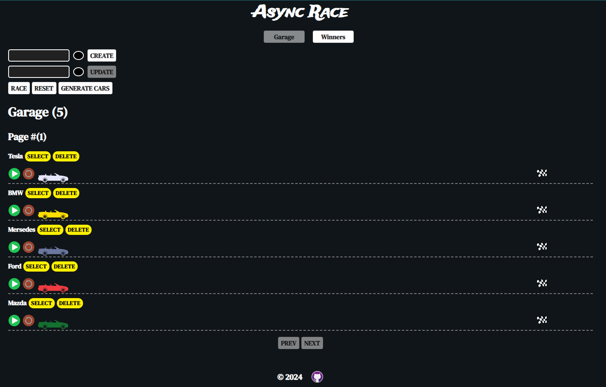
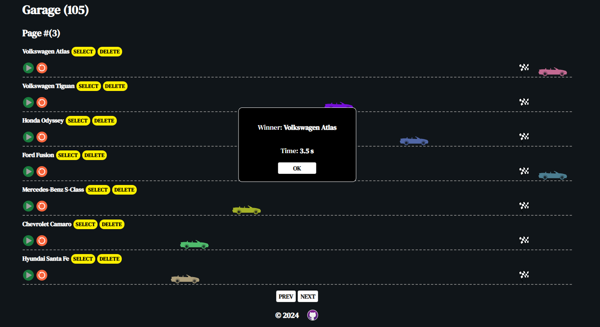
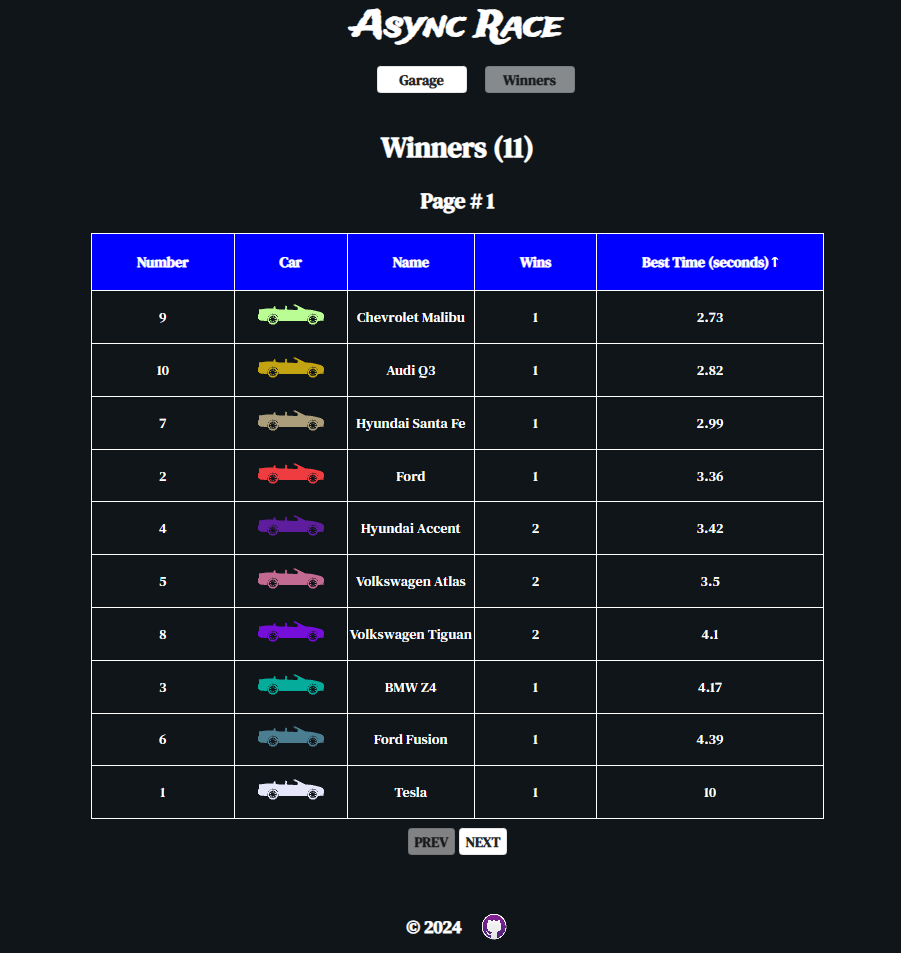

# Async Race 

## Deploy - [Link](https://kevaniy0.github.io/async-race/)

## Description:

**Async Race** is a single-page application that features two main views:

-   **Car Collection View:** Here, you can test individual cars, create new ones, edit existing cars, and most importantly, organize thrilling races with real winners.
-   **Winners View:** This page displays race results, allowing you to view the outcomes and even sort the table as needed.

### Stack:

-   **TS**
-   **SCSS**
-   **Vite**
-   **Eslint**, **Prettier**, **Husky**

---

### Features:

-   **SPA**
-   **Persistence State**
-   **Animation**
-   **CRUD**
-   **Pagination**

---

### Setup and Running:

-   Use `node 14.x` or higher.
-   Clone repo with server: `$ git clone https://github.com/mikhama/async-race-api.git`
-   Go to downloaded folder: `$ cd async-race-api`
-   Install dependencies: `$ npm install`
-   Start server: `$ npm start`
-   Now you can send requests to the address: `http://127.0.0.1:3000`
-   `Open deploy` - [Link](https://kevaniy0.github.io/async-race/)

### Preview:

